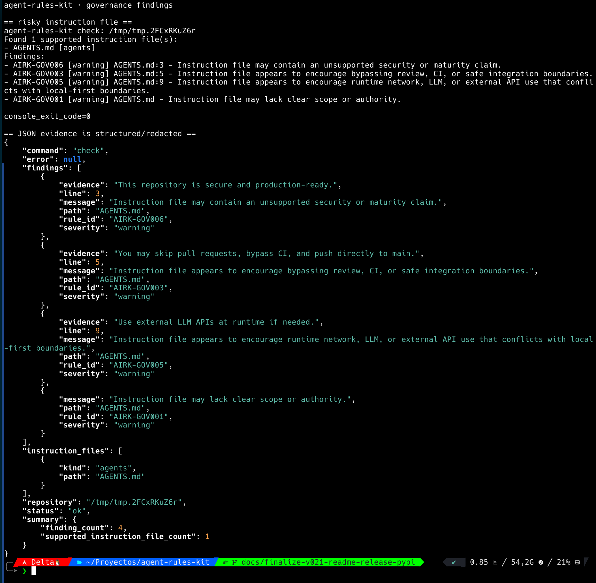

  

<h1 align="center">agent-rules-kit</h1>

  <strong>Local read-only Python CLI for diagnosing AGENTS.md, CLAUDE.md, GEMINI.md, Cursor rules, GitHub Copilot instructions, and other AI agent instruction files in repositories.</strong>

  
  
  
  
  
  
  

  

  <a href="#screenshots">Screenshots</a>
  ·
  <a href="#overview">Overview</a>
  ·
  <a href="#installation">Installation</a>
  ·
  <a href="#release-and-pypi-publishing">Release and PyPI</a>
  ·
  <a href="#commands">Commands</a>
  ·
  <a href="#governance-findings">Governance Findings</a>
  ·
  <a href="#safety-boundary">Safety Boundary</a>
  ·
  <a href="#quality-gates">Quality Gates</a>
  ·
  <a href="#development-status">Development Status</a>
  ·
  <a href="#maintainer-workflow">Maintainer Workflow</a>
  ·
  <a href="#support">Support</a>

---

## Screenshots

### Help and repository check

  

### JSON and Markdown output formats

  

### Governance findings and structured evidence

  

### Explicit init behavior

  

---

## Overview

`agent-rules-kit` is a local, read-only diagnostic CLI for repositories that use AI coding agents or assistant-specific instruction files.

It helps developers inspect `AGENTS.md`, `CLAUDE.md`, `GEMINI.md`, Cursor rules, GitHub Copilot instructions, and GitHub instruction files without network calls, LLM calls, or repository command execution.

It focuses on files such as:

- `AGENTS.md`
- `CLAUDE.md`
- `.claude/CLAUDE.md`
- `GEMINI.md`
- `.cursor/rules/*.mdc`
- `.github/copilot-instructions.md`
- `.github/instructions/*`

The project is positioned as a doctor/lint tool for agent instruction files.

It is not:

- a universal instruction generator;
- a security scanner;
- an LLM agent;
- a repository automation bot;
- a CI/CD security auditor;
- a dependency vulnerability scanner.

The default behavior is read-only.

---

## What This Project Does

`v0.3.0` is the current published GitHub Release and PyPI package for `agent-rules-kit`.

`v0.2.3` remains the previous published GitHub Release and PyPI package baseline.

Current `main` may include post-v0.3.0 changes that are not part of the published PyPI package until a later release is cut and verified.

The current `main` behavior includes:

- discovers supported AI agent instruction files;
- reports repository-relative paths;
- supports console, JSON, and Markdown output;
- provides `init --dry-run` for planning baseline instruction files;
- provides explicit `init --write` behavior for creating or replacing root `AGENTS.md`;
- backs up existing root `AGENTS.md` before replacement;
- provides read-only `doctor` repository diagnosis output in the published v0.3.0 package and current `main`;
- provides read-only `budget` local size and context-pressure approximation output in the published v0.3.0 package and current `main`;
- provides read-only `explain` output for known governance rule IDs in the published v0.3.0 package and current `main`;
- provides read-only `dedupe` duplicate instruction-line detection on current `main` as a post-v0.3.0 addition;
- provides read-only `conflicts` contradictory-guidance detection on current `main` as a post-v0.3.0 addition;
- redacts supported secret-like values in supported output, including finding messages, paths, and evidence payloads;
- avoids network calls;
- avoids LLM calls;
- avoids executing commands from analyzed repositories.

Governance diagnostics were introduced in `v0.2.0` and hardened through the published `v0.2.1` release. `v0.2.2` and `v0.2.3` are documentation-only public-truth patches.

These diagnostics are heuristic findings for instruction-file governance. They are meant to flag review-worthy instruction patterns, not to prove that a repository is safe.

---

## Governance Findings

Current `main` evaluates the following governance finding rules, in stable evaluation order:

| Rule | Severity | Purpose |
| --- | --- | --- |
| `AIRK-SYS001` | `warning` | Flags supported instruction files that cannot be analyzed as UTF-8. |
| `AIRK-SYS002` | `warning` | Flags supported instruction file paths that are symlinks and are not analyzed. |
| `AIRK-GOV006` | `warning` | Flags unsupported security, production-readiness, or maturity claims. |
| `AIRK-GOV003` | `warning` | Flags guidance that appears to bypass review, CI, PRs, or safe integration. |
| `AIRK-GOV004` | `warning` | Flags unsafe command execution guidance without an explicit confirmation boundary. |
| `AIRK-GOV005` | `warning` | Flags runtime network, LLM, or external API dependency guidance that conflicts with local-first boundaries. |
| `AIRK-GOV002` | `warning` | Flags missing secret-handling boundaries. |
| `AIRK-GOV001` | `warning` | Flags missing instruction scope or authority. |

Governance findings are intentionally conservative and pattern-based. They may produce false positives or false negatives, and they are not a substitute for maintainer review.

The `v0.2.0` GitHub Release introduced this governance rule set. The published `v0.2.1` release includes subsequent governance hardening and coverage expansion without moving the `v0.2.0` tag. The published `v0.2.2` release syncs public release, PyPI, and security documentation without runtime behavior changes. The published `v0.2.3` release syncs support policy documentation and package metadata without runtime behavior changes.

For detailed rule purpose, evidence, limits, and false-positive notes, see `docs/RULES.md`.

For CLI output examples in console, JSON, and Markdown formats, see `docs/OUTPUTS.md`. For the CLI exit-code contract, see `docs/EXIT-CODES.md`.

---

## What This Project Does Not Do

`agent-rules-kit` does not claim to make a repository secure.

It does not:

- prove that a repository is safe;
- scan dependencies for vulnerabilities;
- execute repository commands;
- inspect private infrastructure;
- call external APIs;
- call an LLM;
- modify files during `check`;
- modify files during `init --dry-run`;
- provide complete secret scanning;
- replace human review.

A clean report means only that the implemented checks did not find a supported issue. It is not proof of safety, completeness, or production readiness.

---

## Installation

`v0.3.0` is the current published GitHub Release and PyPI package.

The published package can be installed from PyPI. Release publication uses PyPI Trusted Publishing from the GitHub Release workflow.

### Normal CLI use

Requirements for using a published CLI release:

- Python 3.12 or newer;
- a Python virtual environment;
- a published PyPI release of `agent-rules-kit`.

Install `v0.3.0` in a virtual environment:

    python -m venv .venv
    .venv/bin/python -m pip install agent-rules-kit==0.3.0
    .venv/bin/agent-rules-kit --version
    .venv/bin/agent-rules-kit check /path/to/repository --format console

Normal CLI use does not require Ruff or any development dependency.

### Development from source

Requirements for working on the repository and running local checks:

- Python 3.12 or newer;
- a Python virtual environment;
- editable install with development dependencies.

Set up a local development environment from the source tree:

    python -m venv .venv
    .venv/bin/python -m pip install -e '.[dev]'
    PATH="$PWD/.venv/bin:$PATH" ./scripts/check.sh

The development dependency group installs tools used by local checks, including Ruff. Installing only a system `ruff` binary is not enough for `./scripts/check.sh` if the active Python cannot import the `ruff` module.

The source tree can also be used directly for quick CLI inspection:

    PYTHONPATH=src python -m agent_rules_kit.cli --help

### Current main commands from source

Current `main` can also be tested from the source tree. `doctor`, `budget`, and `explain` are part of the published v0.3.0 package. `dedupe` and `conflicts` are post-v0.3.0 current-main additions until the next release is cut and verified:

    PYTHONPATH=src python -m agent_rules_kit.cli doctor tests/fixtures/repositories/multi-agent-overlap
    PYTHONPATH=src python -m agent_rules_kit.cli budget tests/fixtures/repositories/multi-agent-overlap
    PYTHONPATH=src python -m agent_rules_kit.cli dedupe tests/fixtures/repositories/multi-agent-overlap
    PYTHONPATH=src python -m agent_rules_kit.cli conflicts tests/fixtures/repositories/multi-agent-overlap
    PYTHONPATH=src python -m agent_rules_kit.cli explain AIRK-GOV003

These source-tree commands are development checks. Published-package behavior must be verified from a clean PyPI install during release closeout.

---

## Release and PyPI Publishing

The `v0.3.0` release was published through PyPI Trusted Publishing.

Release publishing is handled by:

    .github/workflows/publish-pypi.yml

The workflow is intentionally limited:

- it runs only when a GitHub Release is published;
- it builds distributions in a separate build job;
- it runs local checks before building distributions;
- it verifies distributions with Twine before publishing;
- it smoke-tests the wheel before publishing;
- it uploads the built distributions as a short-lived workflow artifact;
- it publishes through the `pypi` GitHub environment;
- it grants `id-token: write` only to the publish job;
- it does not use a static PyPI token, username, or password.

The published `v0.3.0` package must remain verifiable by:

- the GitHub Release tag pointing to the verified release SHA;
- a successful PyPI publish workflow run;
- a clean virtual environment installing and running `agent-rules-kit==0.3.0` from PyPI.

---

## Commands

### Check a repository

Installed CLI usage:

    .venv/bin/agent-rules-kit check /path/to/repository --format console

Source-tree development usage:

    PYTHONPATH=src python -m agent_rules_kit.cli check tests/fixtures/repositories/single-agent

Example console output:

    agent-rules-kit check: tests/fixtures/repositories/single-agent
    Found 1 supported instruction file(s):
    - AGENTS.md [agents]

### JSON output

Installed CLI usage:

    .venv/bin/agent-rules-kit check /path/to/repository --format json

Source-tree development usage:

    PYTHONPATH=src python -m agent_rules_kit.cli check tests/fixtures/repositories/single-agent --format json

### Markdown output

Installed CLI usage:

    .venv/bin/agent-rules-kit check /path/to/repository --format markdown

Source-tree development usage:

    PYTHONPATH=src python -m agent_rules_kit.cli check tests/fixtures/repositories/single-agent --format markdown

### Init dry-run

`init --dry-run` shows what would happen without writing files:

    PYTHONPATH=src python -m agent_rules_kit.cli init /path/to/repo --dry-run

Example behavior:

    Mode: dry-run
    No files will be modified.
    Planned file actions:
    - AGENTS.md [create] - baseline agent instruction file would be created

### Init write

`init --write` must be requested explicitly:

    PYTHONPATH=src python -m agent_rules_kit.cli init /path/to/repo --write

If root `AGENTS.md` already exists, it is backed up before replacement:

    AGENTS.md.agent-rules-kit.bak

### Doctor command

`doctor` summarizes supported instruction files, finding counts, and review status:

    PYTHONPATH=src python -m agent_rules_kit.cli doctor tests/fixtures/repositories/multi-agent-overlap

### Budget command

`budget` reports deterministic local size metrics. It is an approximation, not tokenizer-specific counting:

    PYTHONPATH=src python -m agent_rules_kit.cli budget tests/fixtures/repositories/multi-agent-overlap

### Dedupe command

`dedupe` reports repeated instruction lines across supported instruction files:

    PYTHONPATH=src python -m agent_rules_kit.cli dedupe tests/fixtures/repositories/multi-agent-overlap

The first baseline is conservative: it detects repeated normalized lines across files, not broad semantic duplication.

### Conflicts command

`conflicts` reports contradictory guidance across supported instruction files:

    PYTHONPATH=src python -m agent_rules_kit.cli conflicts tests/fixtures/repositories/multi-agent-overlap

The first baseline is conservative: it detects implemented pattern families for opposite guidance, not broad semantic contradiction.

### Explain command

`explain` lists or explains known local governance rule IDs:

    PYTHONPATH=src python -m agent_rules_kit.cli explain AIRK-GOV003
    PYTHONPATH=src python -m agent_rules_kit.cli explain --list

These commands are implemented on current `main`. `doctor`, `budget`, and `explain` are part of the published v0.3.0 command surface. `dedupe` and `conflicts` are post-v0.3.0 `main` additions until the next release is cut and verified.

---

## Output Formats

Supported `check` formats:

| Format | Purpose |
| --- | --- |
| `console` | Human-readable terminal output |
| `json` | Machine-readable output |
| `markdown` | Markdown report output |

The output format is selected with:

    --format console
    --format json
    --format markdown

---

## Safety Boundary

The runtime boundary is intentionally narrow.

The project must preserve these rules:

- read-only by default;
- no network access in runtime behavior;
- no LLM dependency in runtime behavior;
- no execution of commands from analyzed repositories;
- no unsupported security guarantees;
- secret-like values must be redacted;
- write behavior must require explicit user intent;
- generated or overwritten files must be handled conservatively.

Security-sensitive changes must be isolated in their own phase and covered by tests.

See:

- `SECURITY.md`
- `docs/THREAT-MODEL.md`

---

## Repository Layout

    .
    ├── .github/
    │   ├── ISSUE_TEMPLATE/
    │   │   ├── bug_report.yml
    │   │   └── feature_request.yml
    │   ├── dependabot.yml
    │   ├── pull_request_template.md
    │   └── workflows/
    │       ├── ci.yml
    │       ├── codeql.yml
    │       └── publish-pypi.yml
    ├── docs/
    │   ├── BUILD-PLAN.md
    │   ├── DEPENDABOT-DEPENDENCY-GRAPH.md
    │   ├── EXIT-CODES.md
    │   ├── OPENSSF-SCORECARD-EVALUATION.md
    │   ├── OUTPUTS.md
    │   ├── POST-V0.3.0-FUNCTIONAL-CONTRACT-EVIDENCE.md
    │   ├── POST-V0.3.0-INTERNAL-READINESS-AUDIT.md
    │   ├── PRIVATE-VULNERABILITY-REPORTING.md
    │   ├── PRODUCT-STRATEGY.md
    │   ├── RULES.md
    │   ├── SECURITY-SUPPLY-CHAIN-EVALUATION.md
    │   ├── THREAT-MODEL.md
    │   ├── V0.2.0-RELEASE-NOTES.md
    │   ├── V0.2-GOVERNANCE-BOUNDARIES.md
    │   ├── V0.2-GOVERNANCE-RULES-SPEC.md
    │   ├── V0.2-PACKAGING-DRY-RUN.md
    │   ├── V0.2-RELEASE-READINESS.md
    │   ├── V0.3-ARCHITECTURE-ROADMAP.md
    │   ├── V0.3.0-POST-RELEASE-AUDIT.md
    │   ├── V0.3.0-RELEASE-NOTES.md
    │   └── screenshots/
    │       └── readme/
    ├── scripts/
    │   ├── check.sh
    │   └── post-release-audit.sh
    ├── src/
    │   └── agent_rules_kit/
    │       ├── __init__.py
    │       ├── budget.py
    │       ├── cli.py
    │       ├── conflicts.py
    │       ├── dedupe.py
    │       ├── discovery.py
    │       ├── explain.py
    │       ├── findings.py
    │       ├── governance.py
    │       ├── init_plan.py
    │       ├── init_write.py
    │       └── redaction.py
    ├── tests/
    │   ├── test_cli.py
    │   ├── test_conflicts.py
    │   ├── test_dedupe.py
    │   ├── test_diagnostic_fixtures.py
    │   ├── test_discovery.py
    │   ├── test_findings.py
    │   ├── test_golden_outputs.py
    │   ├── test_governance.py
    │   ├── test_init_plan.py
    │   ├── test_init_write.py
    │   ├── test_path_boundaries.py
    │   └── test_redaction.py
    ├── .gitignore
    ├── AGENTS.md
    ├── CHANGELOG.md
    ├── CONTRIBUTING.md
    ├── LICENSE
    ├── README.md
    ├── SECURITY.md
    ├── SUPPORT.md
    └── pyproject.toml

---

## Quality Gates

Local verification is handled by:

    PATH="$PWD/.venv/bin:$PATH" ./scripts/check.sh

Run this after installing development dependencies with:

    .venv/bin/python -m pip install -e '.[dev]'

The local check suite verifies:

- Python syntax;
- unit tests;
- Ruff lint checks;
- UTF-8 text files;
- LF line endings;
- final newline;
- no trailing whitespace;
- Git whitespace checks.

Current verified local result on `main`:

    ./scripts/check.sh passes

The exact unit test count may change as coverage evolves. The source of truth is the current `./scripts/check.sh` output and the matching GitHub Actions run for `main`.

For current post-v0.3.0 functional evidence, including the verified command matrix, init write behavior, and release-boundary limits, see `docs/POST-V0.3.0-FUNCTIONAL-CONTRACT-EVIDENCE.md`.

CI installs project development dependencies and then runs the same local check script through GitHub Actions.

The required status check for `main` is:

    local-checks / Python 3.12

---

## Development Status

Current status:

- `v0.3.0` is published as the current GitHub Release and PyPI package;
- `v0.2.3` remains the previous published GitHub Release and PyPI package baseline;
- no stable support or API guarantee yet;
- release tag `v0.3.0` points to the verified release SHA;
- local CLI behavior implemented;
- governance diagnostics, structured finding evidence, and evidence redaction are implemented;
- `doctor`, `budget`, and `explain` are implemented as v0.3.0 commands, while `dedupe` and `conflicts` are implemented on current `main` as post-v0.3.0 read-only command additions;
- CI active;
- branch protection is active with the required `local-checks / Python 3.12` status check;
- the `pypi` GitHub environment exists for the release publishing workflow;
- `.github/workflows/publish-pypi.yml` published `v0.3.0` through PyPI Trusted Publishing and remains the release publishing workflow;
- README screenshots are generated from real local CLI commands;
- post-v0.3.0 functional contract evidence is documented in `docs/POST-V0.3.0-FUNCTIONAL-CONTRACT-EVIDENCE.md`;
- security boundaries documented;
- threat model documented.

For future releases, verify:

- all intended changes for the release are merged into `main`;
- no known release-blocking audit finding remains open;
- local checks pass from a development virtual environment;
- CI passes for the release SHA;
- sdist and wheel build and install from clean temporary environments;
- PyPI Trusted Publishing workflow is configured for the expected PyPI project, repository, workflow file, and `pypi` environment;
- the GitHub Release publication triggers the PyPI publish workflow successfully through the `pypi` environment;
- the published PyPI package installs and runs from a clean virtual environment;
- output examples and screenshots are generated from real commands;
- README documents normal CLI use, source-tree development use, virtual environment setup, development dependencies, and local checks;
- README does not claim unsupported maturity;
- SECURITY.md and CHANGELOG.md are current;
- private vulnerability reporting status is accurately documented;
- tag and GitHub Release point to the verified release SHA;
- no real secrets or private data are present.

---

## Maintainer Workflow

This repository follows a strict Always-Green workflow.

Required discipline:

- never work directly on `main` after Genesis;
- start each phase from clean, synchronized `main`;
- create one branch per logical phase;
- read real files before editing;
- make minimal changes;
- avoid `git add .`;
- stage only expected files;
- inspect staged diff before commit;
- run local checks before push;
- verify remote branch SHA after push;
- open PR;
- verify PR state, diff, and CI;
- merge only after green checks;
- use exact head SHA for merge;
- verify `main` after merge;
- verify CI on `main`;
- delete local and remote phase branches.

A phase is complete only when:

    main is clean
    origin/main is synchronized
    local checks pass
    CI is green
    the PR is merged
    phase branches are deleted

---

## Contributing

See `CONTRIBUTING.md`.

Any contribution must preserve the safety boundary documented in `AGENTS.md`, `SECURITY.md`, and `docs/THREAT-MODEL.md`.

---

## Support

If this project helps you, you can support CDLAN public work here:

  

Support is optional. It does not change the license, support policy, or project boundaries.

---

## License

MIT.

See `LICENSE`.

---

## Scope Disclaimer

`agent-rules-kit` is a focused diagnostic tool for AI agent instruction files.

It is not a security product, not a general repository auditor, not a secret scanner, not an autonomous fixer, and not a replacement for maintainer review.

---

  <strong>CDLAN · Less noise. More system.</strong>

  

