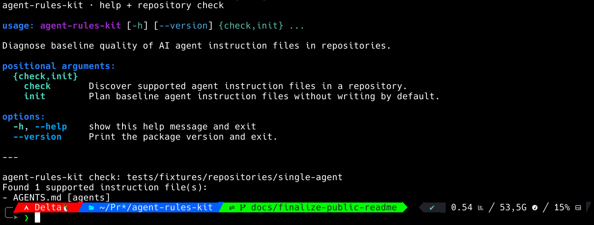
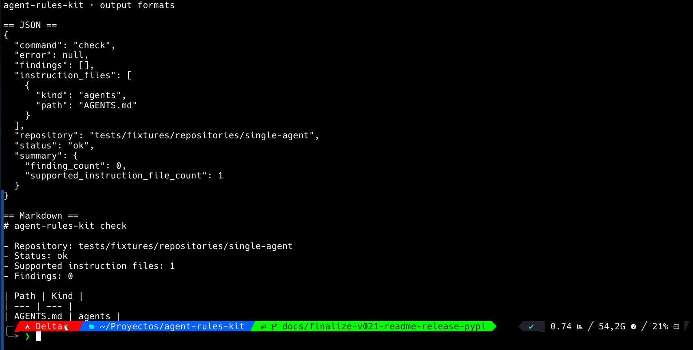
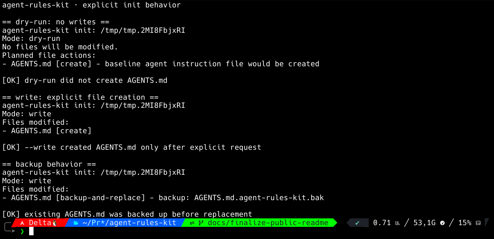

  

<h1 align="center">agent-rules-kit</h1>

  <strong>Local read-only Python CLI for diagnosing AGENTS.md, CLAUDE.md, GEMINI.md, Cursor rules, GitHub Copilot instructions, and other AI agent instruction files in repositories.</strong>

  
  
  
  
  
  
  

  

  <a href="#screenshots">Screenshots</a>
  ·
  <a href="#overview">Overview</a>
  ·
  <a href="#commands">Commands</a>
  ·
  <a href="#governance-findings">Governance Findings</a>
  ·
  <a href="#safety-boundary">Safety Boundary</a>
  ·
  <a href="#quality-gates">Quality Gates</a>
  ·
  <a href="#maintainer-workflow">Maintainer Workflow</a>
  ·
  <a href="#support">Support</a>

---

## Screenshots

### Help and repository check

  

### JSON and Markdown output formats

  

### Explicit init behavior

  

---

## Overview

`agent-rules-kit` is a local, read-only diagnostic CLI for repositories that use AI coding agents or assistant-specific instruction files.

It helps developers inspect `AGENTS.md`, `CLAUDE.md`, `GEMINI.md`, Cursor rules, GitHub Copilot instructions, and GitHub instruction files without network calls, LLM calls, or repository command execution.

It focuses on files such as:

- `AGENTS.md`
- `CLAUDE.md`
- `GEMINI.md`
- `.cursor/rules/*.mdc`
- `.github/copilot-instructions.md`
- `.github/instructions/*`

The project is positioned as a doctor/lint tool for agent instruction files.

It is not:

- a universal instruction generator;
- a security scanner;
- an LLM agent;
- a repository automation bot;
- a CI/CD security auditor;
- a dependency vulnerability scanner.

The default behavior is read-only.

---

## What This Project Does

The published `v0.1.0` GitHub pre-release includes:

- discovers supported AI agent instruction files;
- reports repository-relative paths;
- supports console, JSON, and Markdown output;
- provides `init --dry-run` for planning baseline instruction files;
- provides explicit `init --write` behavior for creating or replacing root `AGENTS.md`;
- backs up existing root `AGENTS.md` before replacement;
- redacts supported secret-like values in findings;
- avoids network calls;
- avoids LLM calls;
- avoids executing commands from analyzed repositories.

Current `main` also contains unreleased v0.2 governance diagnostics.

These diagnostics are heuristic findings for instruction-file governance. They are meant to flag review-worthy instruction patterns, not to prove that a repository is safe.

---

## Governance Findings

Current `main` includes the following unreleased governance finding rules, in stable evaluation order:

| Rule | Severity | Purpose |
| --- | --- | --- |
| `AIRK-GOV006` | `warning` | Flags unsupported security, production-readiness, or maturity claims. |
| `AIRK-GOV003` | `warning` | Flags guidance that appears to bypass review, CI, PRs, or safe integration. |
| `AIRK-GOV004` | `warning` | Flags unsafe command execution guidance without an explicit confirmation boundary. |
| `AIRK-GOV005` | `warning` | Flags runtime network, LLM, or external API dependency guidance that conflicts with local-first boundaries. |
| `AIRK-GOV002` | `warning` | Flags missing secret-handling boundaries. |
| `AIRK-GOV001` | `warning` | Flags missing instruction scope or authority. |

Governance findings are intentionally conservative and pattern-based. They may produce false positives or false negatives, and they are not a substitute for maintainer review.

This v0.2 governance behavior is present on `main` but has not been published as a versioned release yet.

---

## What This Project Does Not Do

`agent-rules-kit` does not claim to make a repository secure.

It does not:

- prove that a repository is safe;
- scan dependencies for vulnerabilities;
- execute repository commands;
- inspect private infrastructure;
- call external APIs;
- call an LLM;
- modify files during `check`;
- modify files during `init --dry-run`;
- provide complete secret scanning;
- replace human review.

A clean report means only that the implemented checks did not find a supported issue. It is not proof of safety, completeness, or production readiness.

---

## Installation

`v0.1.0` is available as GitHub pre-release artifacts.

This project is not published to PyPI yet.

Download the wheel from the `v0.1.0` GitHub Release, then install it in a virtual environment:

    python -m venv .venv
    .venv/bin/python -m pip install ./agent_rules_kit-0.1.0-py3-none-any.whl
    .venv/bin/agent-rules-kit --version

The source tree can still be used directly for development:

    PYTHONPATH=src python -m agent_rules_kit.cli --help

---

## Commands

### Check a repository

    PYTHONPATH=src python -m agent_rules_kit.cli check tests/fixtures/repositories/single-agent

Example console output:

    agent-rules-kit check: tests/fixtures/repositories/single-agent
    Found 1 supported instruction file(s):
    - AGENTS.md [agents]

### JSON output

    PYTHONPATH=src python -m agent_rules_kit.cli check tests/fixtures/repositories/single-agent --format json

### Markdown output

    PYTHONPATH=src python -m agent_rules_kit.cli check tests/fixtures/repositories/single-agent --format markdown

### Init dry-run

`init --dry-run` shows what would happen without writing files:

    PYTHONPATH=src python -m agent_rules_kit.cli init /path/to/repo --dry-run

Example behavior:

    Mode: dry-run
    No files will be modified.
    Planned file actions:
    - AGENTS.md [create] - baseline agent instruction file would be created

### Init write

`init --write` must be requested explicitly:

    PYTHONPATH=src python -m agent_rules_kit.cli init /path/to/repo --write

If root `AGENTS.md` already exists, it is backed up before replacement:

    AGENTS.md.agent-rules-kit.bak

---

## Output Formats

Supported `check` formats:

| Format | Purpose |
| --- | --- |
| `console` | Human-readable terminal output |
| `json` | Machine-readable output |
| `markdown` | Markdown report output |

The output format is selected with:

    --format console
    --format json
    --format markdown

---

## Safety Boundary

The runtime boundary is intentionally narrow.

The project must preserve these rules:

- read-only by default;
- no network access in runtime behavior;
- no LLM dependency in runtime behavior;
- no execution of commands from analyzed repositories;
- no unsupported security guarantees;
- secret-like values must be redacted;
- write behavior must require explicit user intent;
- generated or overwritten files must be handled conservatively.

Security-sensitive changes must be isolated in their own phase and covered by tests.

See:

- `SECURITY.md`
- `docs/THREAT-MODEL.md`

---

## Repository Layout

    .
    ├── .github/
    │   ├── ISSUE_TEMPLATE/
    │   ├── pull_request_template.md
    │   └── workflows/
    │       └── ci.yml
    ├── docs/
    │   ├── BUILD-PLAN.md
    │   ├── THREAT-MODEL.md
    │   └── screenshots/
    │       └── readme/
    │           ├── agent-rules-kit-help-check.png
    │           ├── agent-rules-kit-init-safety.png
    │           └── agent-rules-kit-output-formats.png
    ├── scripts/
    │   └── check.sh
    ├── src/
    │   └── agent_rules_kit/
    │       ├── cli.py
    │       ├── discovery.py
    │       ├── findings.py
    │       ├── init_plan.py
    │       ├── init_write.py
    │       └── redaction.py
    ├── tests/
    ├── AGENTS.md
    ├── CHANGELOG.md
    ├── CONTRIBUTING.md
    ├── LICENSE
    ├── README.md
    ├── SECURITY.md
    ├── SUPPORT.md
    └── pyproject.toml

---

## Quality Gates

Local verification is handled by:

    ./scripts/check.sh

The local check suite verifies:

- Python syntax;
- unit tests;
- UTF-8 text files;
- LF line endings;
- final newline;
- no trailing whitespace;
- Git whitespace checks.

Current verified local result on `main`:

    Ran 83 tests

    OK

CI runs the same local check script through GitHub Actions.

The required status check for `main` is:

    local-checks / Python 3.12

---

## Development Status

Current status:

- `v0.1.0` is published as a GitHub pre-release;
- no public stable release yet;
- release tag `v0.1.0` points to the verified release SHA;
- wheel and sdist artifacts are attached to the GitHub Release;
- release assets were downloaded, checksum-verified, installed, and smoke-tested;
- local CLI behavior implemented;
- CI active;
- branch protection active;
- README distinguishes the published `v0.1.0` pre-release from current `main` / unreleased v0.2 governance behavior;
- security boundaries documented;
- threat model documented.

For future releases, verify:

- local checks pass;
- CI passes for the release SHA;
- sdist and wheel build and install from clean temporary environments;
- release assets can be downloaded, checksum-verified, installed, and smoke-tested;
- output examples are generated from real commands;
- README does not claim unsupported maturity;
- SECURITY.md and CHANGELOG.md are current;
- private vulnerability reporting is enabled or its absence is clearly documented;
- tag and GitHub Release point to the verified release SHA;
- no real secrets or private data are present.

---

## Maintainer Workflow

This repository follows a strict Always-Green workflow.

Required discipline:

- never work directly on `main` after Genesis;
- start each phase from clean, synchronized `main`;
- create one branch per logical phase;
- read real files before editing;
- make minimal changes;
- avoid `git add .`;
- stage only expected files;
- inspect staged diff before commit;
- run local checks before push;
- verify remote branch SHA after push;
- open PR;
- verify PR state, diff, and CI;
- merge only after green checks;
- use exact head SHA for merge;
- verify `main` after merge;
- verify CI on `main`;
- delete local and remote phase branches.

A phase is complete only when:

    main is clean
    origin/main is synchronized
    local checks pass
    CI is green
    the PR is merged
    phase branches are deleted

---

## Contributing

See `CONTRIBUTING.md`.

Any contribution must preserve the safety boundary documented in `AGENTS.md`, `SECURITY.md`, and `docs/THREAT-MODEL.md`.

---

## Support

If this project helps you, you can support CDLAN public work here:

  

Support is optional. It does not change the license, support policy, or project boundaries.

---

## License

MIT.

See `LICENSE`.

---

## Scope Disclaimer

`agent-rules-kit` is a focused diagnostic tool for AI agent instruction files.

It is not a security product, not a general repository auditor, not a secret scanner, not an autonomous fixer, and not a replacement for maintainer review.

---

  <strong>CDLAN · Less noise. More system.</strong>

  

